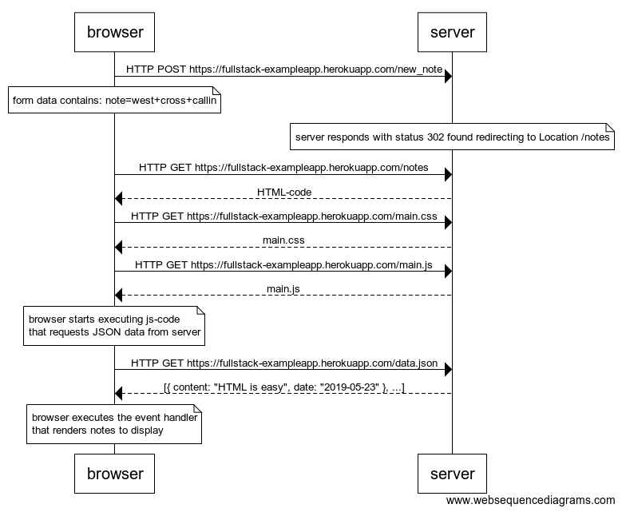
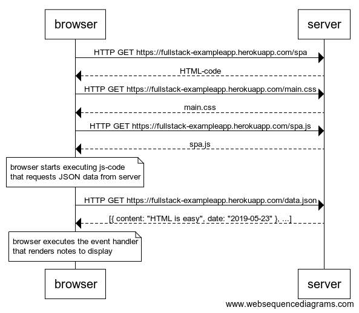
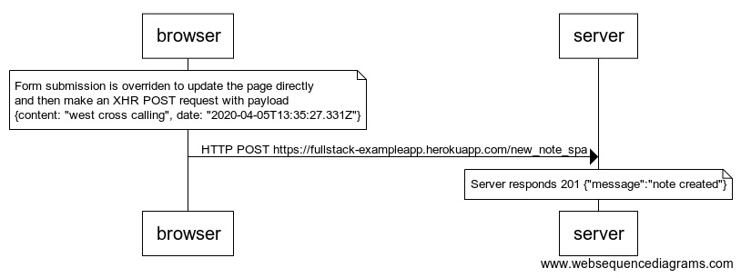

## 0.1 HTML

Read [Mozilla tutorial](https://developer.mozilla.org/en-US/docs/Learn/Getting_started_with_the_web/HTML_basics)

## 0.2 CSS

Read [Mozilla tutorial](https://developer.mozilla.org/en-US/docs/Learn/Getting_started_with_the_web/CSS_basics)

## 0.3 HTML forms

Read [Mozilla tutorial](https://developer.mozilla.org/en-US/docs/Learn/HTML/Forms/Your_first_HTML_form)

## 0.4 AJAX App Sequence diagram, new note

For the AJAX App

https://www.websequencediagrams.com/

```
browser->server: HTTP POST https://fullstack-exampleapp.herokuapp.com/new_note

note over browser:
form data contains: note=west+cross+callin
end note
note over server:
server responds with status 302 found redirecting to Location /notes
end note

browser->server: HTTP GET https://fullstack-exampleapp.herokuapp.com/notes
server-->browser: HTML-code
browser->server: HTTP GET https://fullstack-exampleapp.herokuapp.com/main.css
server-->browser: main.css
browser->server: HTTP GET https://fullstack-exampleapp.herokuapp.com/main.js
server-->browser: main.js

note over browser:
browser starts executing js-code
that requests JSON data from server 
end note

browser->server: HTTP GET https://fullstack-exampleapp.herokuapp.com/data.json
server-->browser: [{ content: "HTML is easy", date: "2019-05-23" }, ...]

note over browser:
browser executes the event handler
that renders notes to display
end note
```



## 0.5 Single Page App, main page



```
browser->server: HTTP GET https://fullstack-exampleapp.herokuapp.com/spa
server-->browser: HTML-code
browser->server: HTTP GET https://fullstack-exampleapp.herokuapp.com/main.css
server-->browser: main.css
browser->server: HTTP GET https://fullstack-exampleapp.herokuapp.com/spa.js
server-->browser: spa.js

note over browser:
browser starts executing js-code
that requests JSON data from server 
end note

browser->server: HTTP GET https://fullstack-exampleapp.herokuapp.com/data.json
server-->browser: [{ content: "HTML is easy", date: "2019-05-23" }, ...]

note over browser:
browser executes the event handler
that renders notes to display
end note
```

## 0.6 Single Page App, new note



```
note over browser:
Form submission is overriden to update the page directly
and then make an XHR POST request with payload
{content: "west cross calling", date: "2020-04-05T13:35:27.331Z"}
end note

browser->server: HTTP POST https://fullstack-exampleapp.herokuapp.com/new_note_spa

note over server:
Server responds 201 {"message":"note created"}
end note
```
